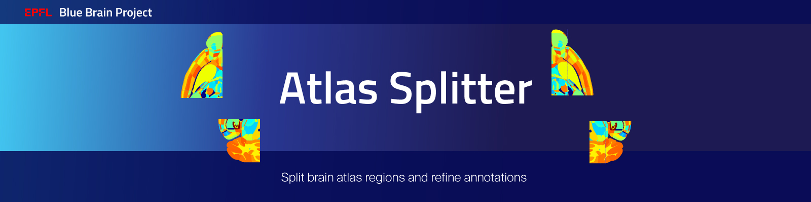

|banner|

Overview
=========

This project contains tools to split brain atlas regions and refine annotations accordingly.

After installation, you can display the available command lines with the following ``bash`` command:

.. code-block:: bash

    atlas-splitter --help

Installation
============

.. code-block:: bash

    pip install atlas-splitter

Examples
========

To split the layer 2/3 of the AIBS mouse isocortex and save modified hierarchy and annotation files, one performs the following:

Note that the required datasets under `data/*` can be generated by following the example in `atlas-direction-vectors`_.

.. code-block:: bash

   atlas-splitter split-isocortex-layer-23                         \
     --hierarchy-path data/1.json                                  \
     --annotation-path data/ccfv3/annotation_25.nrrd               \
     --direction-vectors-path data/ccfv3/direction_vectors.nrrd    \
     --output-hierarchy-path data/ccfv3/split_hierarchy.json        \
     --output-annotation-path data/ccfv3/split_annotations.nrrd

To add barrel annotations to the Barrel Cortex and save modified hierarchy and annotation files, one performs the following:

.. code-block:: bash

   atlas-splitter split-barrel-columns                        \
     --hierarchy-path data/1.json                                  \
     --annotation-path data/ccfv3/annotation_25.nrrd               \
     --barrels-path data/barrel_positions.feather                   \
     --output-hierarchy-path data/ccfv3/split_hierarchy.json        \
     --output-annotation-path data/ccfv3/split_annotations.nrrd

Instructions for developers
===========================

Run the following commands before submitting your code for review:

.. code-block:: bash

    cd atlas-splitter
    isort -l 100 --profile black atlas_splitter tests setup.py
    black -l 100 atlas_splitter tests setup.py

These formatting operations will help you pass the linting check ``testenv:lint`` defined in ``tox.ini``.

Citation
========

When you use this software, we kindly ask you to cite the following DOI:

.. image:: https://zenodo.org/badge/451806666.svg
   :target: https://zenodo.org/badge/latestdoi/451806666

Acknowledgements
================

The development of this software was supported by funding to the Blue Brain Project, a research center of the École polytechnique fédérale de Lausanne (EPFL), from the Swiss government’s ETH Board of the Swiss Federal Institutes of Technology.

For license and authors, see LICENSE.txt and AUTHORS.txt respectively.

Copyright (c) 2022-2024 Blue Brain Project/EPFL

.. _`atlas-direction-vectors`: https://github.com/BlueBrain/atlas-direction-vectors

.. substitutions

